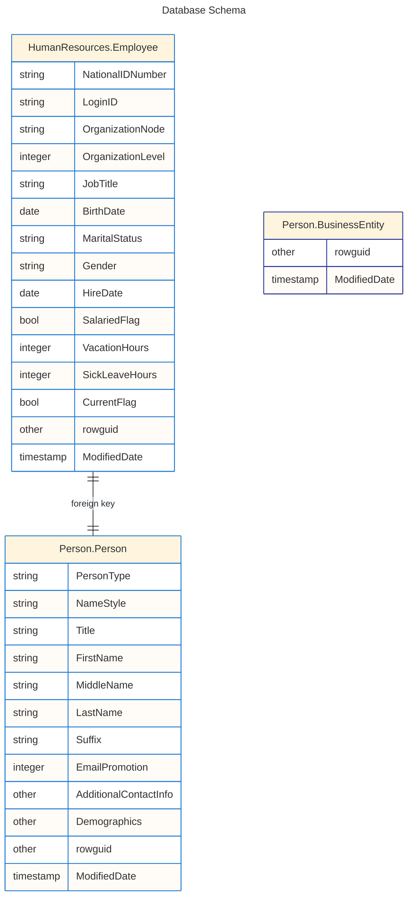

# Diagram

```mermaid
---
title: Database Schema
config:
  theme: base
---
erDiagram

  classDef strong_entity stroke:#283593;
  classDef subtype stroke:#1976D2;
  classDef weak_entity stroke:#1976D2;
  classDef unknown stroke:#AAAAAA;
  classDef non_entity stroke:#AAAAAA;

  "HumanResources.Employee":::subtype {
    string NationalIDNumber
    string LoginID
    string OrganizationNode
    integer OrganizationLevel
    string JobTitle
    date BirthDate
    string MaritalStatus
    string Gender
    date HireDate
    bool SalariedFlag
    integer VacationHours
    integer SickLeaveHours
    bool CurrentFlag
    other rowguid
    timestamp ModifiedDate
  }

  "Person.BusinessEntity":::strong_entity {
    other rowguid
    timestamp ModifiedDate
  }

  "Person.Person":::subtype {
    string PersonType
    string NameStyle
    string Title
    string FirstName
    string MiddleName
    string LastName
    string Suffix
    integer EmailPromotion
    other AdditionalContactInfo
    other Demographics
    other rowguid
    timestamp ModifiedDate
  }


  "HumanResources.Employee"  ||--||  "Person.Person" : "foreign key"
```
