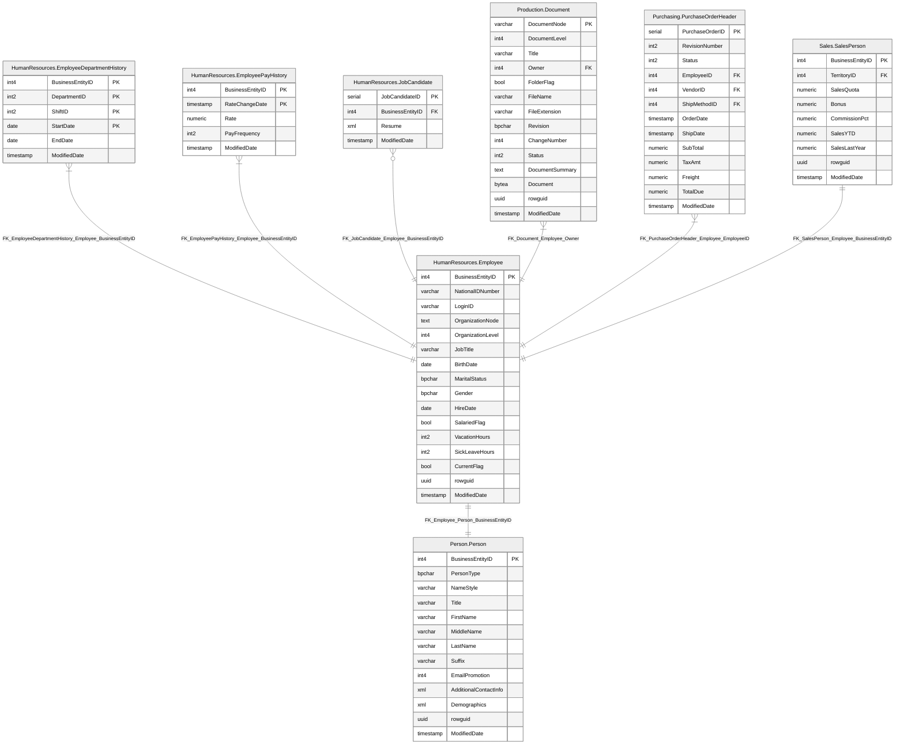

# Table "HumanResources"."Employee"

## Metadata

- Type: Table
- Entity model type: Subtype
- Column count: 16
- Foreign key count: 1
- Trigger count: 0

## Columns

### "HumanResources"."Employee"

| Name | Type | Nullable | Default | Remarks | Auto-incremented | Generated |
| --- | --- | --- | --- | --- | --- | --- |
| BusinessEntityID | int4 | NOT NULL |  |  |  |  |
| NationalIDNumber | varchar\(15\) | NOT NULL |  |  |  |  |
| LoginID | varchar\(256\) | NOT NULL |  |  |  |  |
| OrganizationNode | text | NULL |  |  |  |  |
| OrganizationLevel | int4 | NULL |  |  |  |  |
| JobTitle | varchar\(50\) | NOT NULL |  |  |  |  |
| BirthDate | date | NOT NULL |  |  |  |  |
| MaritalStatus | bpchar\(1\) | NOT NULL |  |  |  |  |
| Gender | bpchar\(1\) | NOT NULL |  |  |  |  |
| HireDate | date | NOT NULL |  |  |  |  |
| SalariedFlag | bool | NOT NULL | true |  |  |  |
| VacationHours | int2 | NOT NULL | 0 |  |  |  |
| SickLeaveHours | int2 | NOT NULL | 0 |  |  |  |
| CurrentFlag | bool | NOT NULL | true |  |  |  |
| rowguid | uuid | NOT NULL | public\.uuid\_generate\_v4\(\) |  |  |  |
| ModifiedDate | timestamp | NOT NULL | CURRENT\_DATE |  |  |  |

## Primary Key

### PK_Employee_BusinessEntityID
| Name |
| --- |
| BusinessEntityID |

## Indexes

### IX_Employee_OrganizationNode

| Name | Type |
| --- | --- |
| OrganizationNode | ASC |
### AK_Employee_rowguid

unique index

| Name | Type |
| --- | --- |
| rowguid | ASC |
### AK_Employee_LoginID

unique index

| Name | Type |
| --- | --- |
| LoginID | ASC |
### AK_Employee_NationalIDNumber

unique index

| Name | Type |
| --- | --- |
| NationalIDNumber | ASC |
### IX_Employee_OrganizationLevel_OrganizationNode

| Name | Type |
| --- | --- |
| OrganizationLevel | ASC |
| OrganizationNode | ASC |

## Foreign Keys

### FK_Employee_Person_BusinessEntityID

"HumanResources"."Employee" ||--|| ["Person"."Person"](../tables/person_c91162ff.md)

- BusinessEntityID --> "Person"."Person"."BusinessEntityID"

## Attributes

| Attribute | Value |
| --- | --- |

## Diagram

## Cross-References

### Referenced by
- ["HumanResources"."EmployeeDepartmentHistory"](../tables/employeedepartmenthistory_c3fff7b.md)
- ["HumanResources"."EmployeePayHistory"](../tables/employeepayhistory_b0475801.md)
- ["HumanResources"."JobCandidate"](../tables/jobcandidate_fb72ee2d.md)
- ["Production"."Document"](../tables/document_41c277e1.md)
- ["Purchasing"."PurchaseOrderHeader"](../tables/purchaseorderheader_c13bfa1b.md)
- ["Sales"."SalesPerson"](../tables/salesperson_4390b854.md)

### References
- ["Person"."Person"](../tables/person_c91162ff.md)

